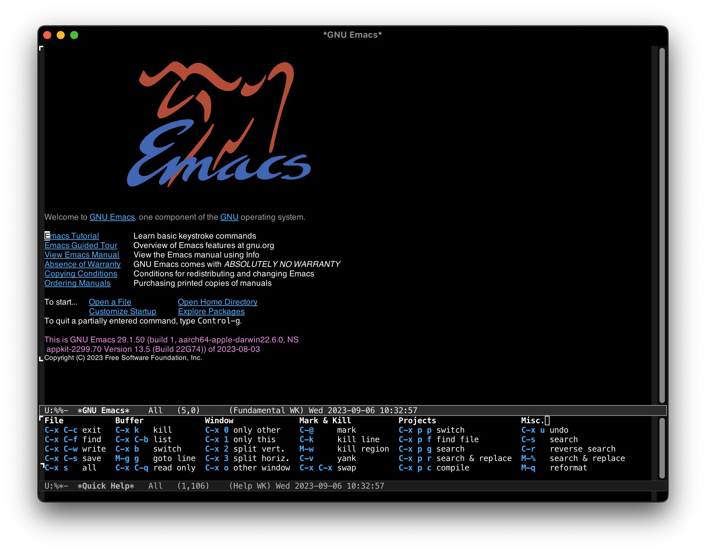
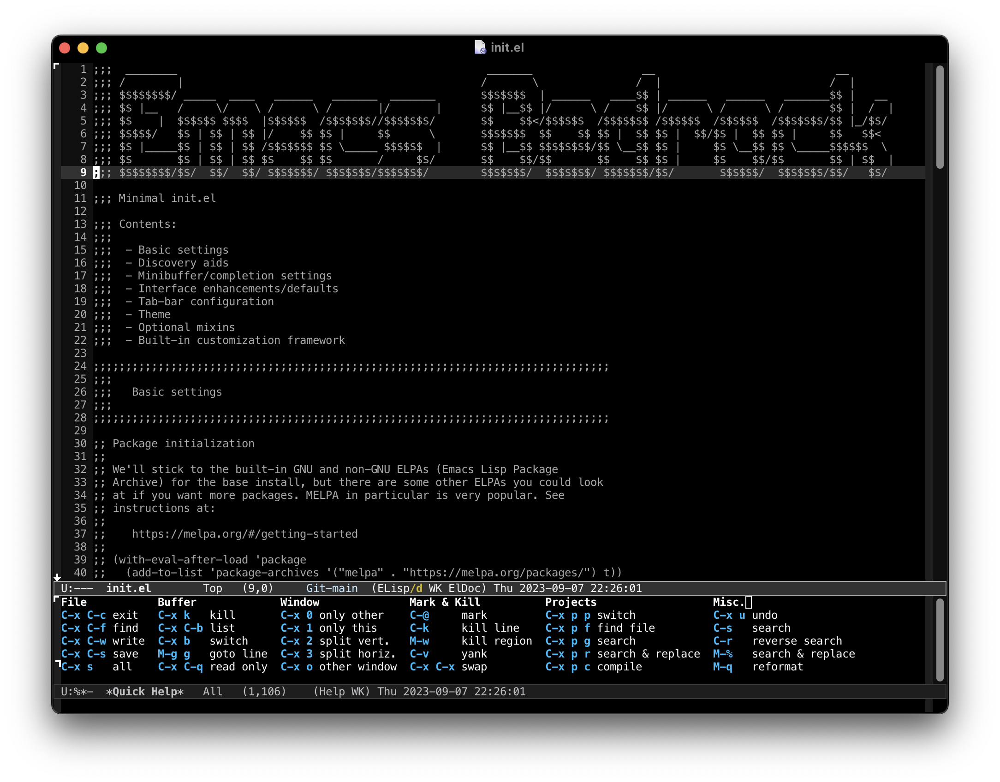
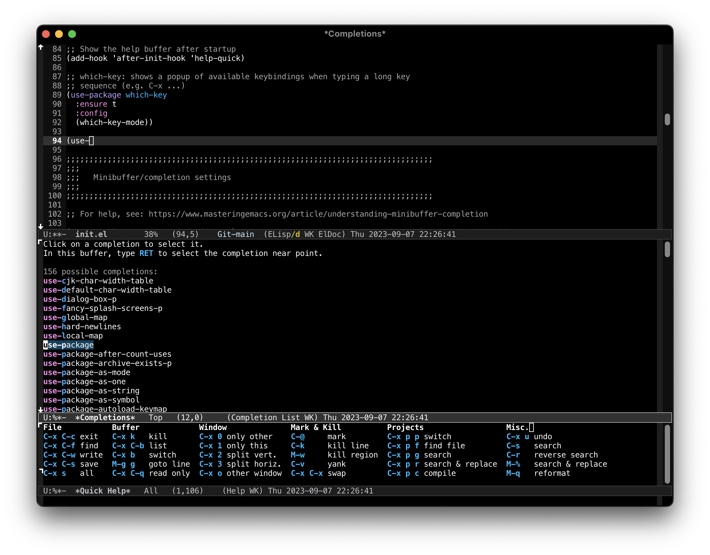
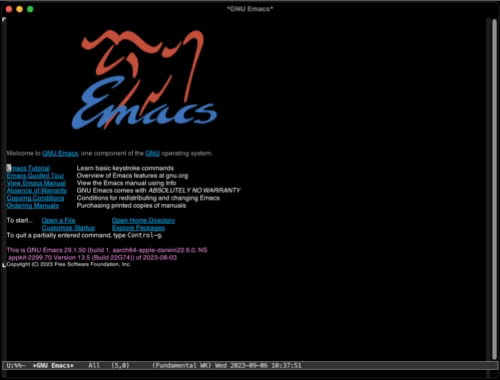

# Emacs Bedrock

Stepping stones to a better Emacs experience

## Synopsis

An *extremely* minimal Emacs starter kit uses just one external package by default, and only GNU-ELPA packages on an opt-in basis. Intended to be copied once and then modified as the user grows in knowledge and power.

As of 2024-02-07, Bedrock is officially hosted on [Codeberg](https://codeberg.org/ashton314/emacs-bedrock).

Mirrors:
 - [Old project on SourceHut](https://sr.ht/~ashton314/emacs-bedrock/)
 - [GitHub](https://github.com/ashton314/emacs-bedrock) (just a place holder)

**NOTICE:** Requires Emacs 29.1 or better.

## Description

This is a minimal Emacs starter kit. Like, *really* minimal. Here's the short of the philosophy:

 - Focus on using default, built-in Emacs behavior

   Yes, we all love our fancy third-party packages. This starter kit focuses on what is built-in to Emacs. Why? Because there are too many good packages and picking and choosing the best is a joy we leave to the user.

 - Explain every customization and encourage modification

   The goal of this starter kit is to encourage end-user adaptation and growth. All of the `.el` files should be legible and, more importantly, justify in plain English the rationale for adding the configuration they do.

 - No magic

   We keep things *crushingly* simple here. That means no fancy loadable modules or whatnot. Everything is as straight-forward as can be.

There are two files of interest: `early-init.el` and `init.el`.

### `early-init.el`

The early init file uses *strictly* built-in Emacs features to do the following:

 - Improve startup time
 - Set up initial frame behavior

### `init.el`

This is where the meat of all configuration goes. This file:

 - Add minor UI niceties (e.g. clock in the tab-bar, full-screen by default, etc.)
 - Set the default theme (`modus-vivendi`)
 - Turn on discovery aids (e.g. `help-quick`, [which-key](https://github.com/justbur/emacs-which-key), etc.)

### Trying this out without committing too hard

Emacs 29.1 added the handy `--init-directory` flag. This means that you can run `emacs --init-directory path/to/emacs-bedrock/` and all the customizations and package installations will be isolated to the project directory. Emacs should only add files that are already in the `.gitignore`.

Once you're happy, you should just copy `init.el` and `early-init.el` to `~/.emacs.d/`.

## Screenshots

What you should see on opening Emacs up with Bedrock installed: a simple splash screen, [modus-vivendi](https://protesilaos.com/emacs/modus-themes) active, and the `help-quick` display at the bottom.



Basic code editing: line numbers and `hl-line-mode`.



`which-key` package in action: hit `C-x` and wait for a second to get a pop-up window of what all next available keybindings are.


[Movie of `which-key` in motion](screenshots/which_key.mov)

Basic completion: hit `TAB` twice to pull up the `*Completions*` buffer, then `TAB` once again to automatically put the cursor into that buffer. (Configurable to pull up and auto-select faster, of course, but this behaves closer to the stock Emacs experience.)



Basic completion interface in action.



[Movie of the completion interface in action](screenshots/basic_completion.mov)

A bunch of bells and whistles:

 - Vertico completion framework enabled (`base.el` extra)
 - Consult enabled for buffer-switching preview (`base.el` extra)
 - Corfu completion-at-point enabled (`base.el` extra)
 - Smooth scrolling (enabled by default)

[Movie of all the bells and whistles turned on](screenshots/everything_demo.mov)

## Extras

For those who'd like a little more help in tailoring Emacs for specific purposes, the `extras/` folder contains a few Emacs Lisp files with example configurations for various packages. You can copy just the config you want into `init.el` or include them wholesale via `(load-file "~/.emacs.d/extras/file-name.el")`.

**NOTE:** If you copy the `extras/` directory to `~/.emacs.d/` or wherever you're setting `user-emacs-directory`, then simply incrementing the appropriate lines in the `init.el` file should work.

Extras:

 - Base UI Enhancements
 - Development tools
 - Org-mode
 - Vim refugee
 - Researcher
 - Email (TODO: mu4e, EBDB)

#### Base UI Enhancements: `extras/base.el`

Packages this extra adds:

 - [Avy](https://github.com/abo-abo/avy)
 - [Embark](https://github.com/oantolin/embark)
 - [Vertico](https://github.com/minad/vertico)
 - [Marginalia](https://github.com/minad/marginalia/)
 - [Corfu](https://github.com/minad/corfu)
 - [Consult](https://github.com/minad/consult)
 - [Orderless](https://github.com/oantolin/orderless)
 - [wgrep](https://github.com/mhayashi1120/Emacs-wgrep)

Along with a few ancillary packages that enhance the above.

These are some of the best UI enhancements that Emacs has to offer. Vertico and Consult make common operations like searching files, switching buffers, etc. a breeze. Corfu enhances the "completion at point" (aka "tab-to-complete") to show a little popup window like what you'd be used to in e.g. VS Code.

Avy is the fastest way to move around in a buffer, and it can do a *lot*.[^1] Embark is kind of like a right-click context menu, but entirely keyboard driven.

wgrep makes grep buffers editable. This means you can `consult-ripgrep` → search project → `embark-act` → `embark-export` → `wgrep-change-to-wgrep-mode` to do search-and-replace across an entire project in one fell swoop. See [Warp Factor Refactoring](https://lambdaland.org/posts/2023-05-31_warp_factor_refactor/) for more on this workflow.

#### Development tools: `extras/dev.el`

Packages this extra adds:

 - [magit](https://magit.vc)
 - Markdown, YAML, and JSON modes

Magit is the best Git interface in the known universe. Some people use Emacs just so they can use Magit. It's that good. Entry point is bound to `C-c g` by default.

Built-in packages that this extra configures:

 - [Eglot](https://github.com/joaotavora/eglot) ([Language Server Protocol (LSP) client](https://microsoft.github.io/language-server-protocol/))
 - Treesit ([Tree-Sitter](https://github.com/tree-sitter) support)

Both of these packages are new in Emacs 29. **Be sure to run `M-x treesit-install-language-grammar` to install the language grammar you'll need before editing a file the respective language for the first time!** This is a quirk of how the built-in tree-sitter works; packages like [treesit-auto](https://github.com/renzmann/treesit-auto) can help with this if it becomes too much of an annoyance.

#### Org-mode: `extras/org.el`

This extra configures `org-mode`. There is a *lot* that Bedrock cannot configure out of the box—you will need to modify all variables to fit your file system and needs, as explained in comments in the file.

#### Vim refugee: `extras/vim-like.el`

Packages this extra adds:

 - [Evil](https://github.com/emacs-evil/evil)

If you like Vim keybindings, then this is the extra for you. It configures `evil-mode` and enables it, so you get Vim-like keybindings all throughout Emacs. I understand that this is the best Vim emulation outside of Vim itself. I use `evil-mode` in all my work.

Other packages that I use personally, but are not on GNU or non-GNU ELPA and so left out of the config include:

 - [Evil-Collection](https://github.com/emacs-evil/evil-collection) Add Evil-friendly keybindings to lots of corners of Emacs
 - [Evil-Leader](https://github.com/cofi/evil-leader) Setting a prefix (i.e. "leader") key
 - [Origami](https://github.com/gregsexton/origami.el) Code folding

#### Researcher: `extras/researcher.el`

Packages this extra includes:

 - [Citar](https://github.com/emacs-citar/citar)
 - [Org-roam](https://www.orgroam.com/)
 - [Denote](https://protesilaos.com/emacs/denote)

Citar provides a completing-read interface into your bibliography and can automatically insert citations in LaTeX, Markdown, and org-mode.

Org-roam is a personal knowledge management system; effectively a port of the popular [Roam](https://roamresearch.com/) note taking system.

Denote is a simple note taking system that doesn't rely on any tools except some common Unix utilities like `grep` and `find`.

Citar and Org-roam both live in [Melpa](https://melpa.org/), so you will need to [add Melpa to your package-archives](https://melpa.org/#/getting-started).

#### Email `extras/email.el`

TODO

## Using

Clone this repository wherever. Then you should copy `early-init.el`, `init.el`, and (optionally, recommended) `extras/` into your `~/.emacs.d/` repository:

```bash
git clone https://git.sr.ht/~ashton314/emacs-bedrock
mkdir -p ~/.emacs.d/
cp emacs-bedrock/early-init.el ~/.emacs.d/
cp emacs-bedrock/init.el ~/.emacs.d/
cp -r emacs-bedrock/extras ~/.emacs.d/
```

Fire up Emacs and you're good to go!

### Philosophy

Many people are looking for a good set of defaults and some easy-to-use switches that let Emacs get out of the way and let them work on what they want to. This is fine. This is not what Bedrock tries to do.

Emacs is the most customizable piece of software in existence. (No citation needed.) My goal with Bedrock is to make Emacs a little nicer by enabling some things that I personally think should be enabled by default. Bedrock goes a little further by suggesting a few well-built packages that go on to enhance the experience.

Bedrock encourages inspection and modification. I don't plan on making some core that periodically gets updated. You can think of this as just some guy's config that you wanted to adopt.

As an example of a deliberate choice, the `help-quick` buffer pops open on startup. Once a user has gotten used to this, they can just go into their `init.el` file and modify it themselves to remove that hook if they don't like it. It's a simple one-line change, and only users who are ready for it will do it.

When I started learning Emacs, my dad gave me his `.emacs` file. (That's what we used back in ye olden days instead of `.emacs.d/init.el` and stuff.) I used it without modification for many years. Eventually I learned how to write my own functions and customizations. This package aims to give other users a similar experience. When someone comes to me and expresses their desire to learn Emacs, I can point them at this to help them get over the initial hump, but not coddle them so much that they're afraid or unable to change things to their liking.

## Requirements

Emacs 29.1 or later.

Emacs 29.1 is, as of 2023-09-04, the latest stable release. The specific features from Emacs 29.1 that Bedrock relies on are:

 - The `use-package` macro for configuration
 - Enhancements to the built-in completion help (`completions-auto-select`, `completion-auto-help`, etc.)
 - Built-in tree-sitter support
 - Built-in LSP client (Eglot)

## Development

This is version `1.3.1`.

As of `1.0.0`, no new `use-package` declarations will be added to `init.el`. No promises on the extras! 

I welcome any feedback you may have. You can [open issues](https://todo.sr.ht/~ashton314/emacs-bedrock) or [drop me a line](https://lambdaland.org/#contact) directly with any comments or suggestions.

Thanks to all the folks who have contributed suggestions and bug reports. Thank you also for being patient with me as I work on this project as a hobby. :)

### Roadmap

See the [issue tracker](https://todo.sr.ht/~ashton314/emacs-bedrock) on SourceHut.

## Changelog

 - 1.3.1
 
   Fix consult-history binding in Eshell to not override `isearch-backwards`. (#13)

 - 1.3.0

   Change magit keybinding to standard `C-x g`; drop non-standard ones. (Thanks Vincent Conus!)

   Don't set `C-s` to `consult-line` in `extras/base.el`; instead, use the recommended keybindings from the Consult manual. (Thanks Enzo Do rosario, Thomas Riccardi, and Preston Hunt for discussion!)

   Add sample Denote config.

   Improve latency by slowing down auto-revert polling. (Thanks Jeff Johnson!)

 - 1.2.0

   2023-09-21

   Add packages [Cape](https://github.com/minad/cape) (+ basic configuration) and wgrep. Add a binding for `consult-ripgrep`.

 - 1.1.0

   2023-09-08

   Rename "mixins" → "extras", as mixin has the flavor of being some kind of special thingy. "Extra" gets at the purpose of these files.

 - 1.0.0

   2023-09-04

   First "stable" release! Line number width improved, fix default load paths, expand Eglot and Vertico config, fix Corfu load.

 - 0.2.1

   2023-06-20

   Minor bug fixes; add Embark package.

 - 0.2.0

   2023-03-14

   Flesh out the `mixin/vim-like.el` so that there's *some* Vim configuration.

 - 0.1.0

   2023-01-17

   Begin work on `mixin/org.el`, turn on windmove-mode.

 - 0.0.2

   2023-01-03

   Reorganize to slim down `early-init.el` and add the first mixin files.

 - 0.0.1

   2023-01-03

   Initial "release".

## Authors

Creator and maintainer:

 - Ashton Wiersdorf https://lambdaland.org

Contributors:

 - George Kettleborough
 - Enzo Do Rosario
 - Ed Singleton
 - Vincent Conus

[^1]: https://karthinks.com/software/avy-can-do-anything/
